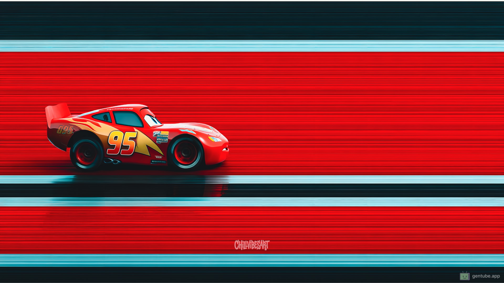

## Wallpapers Directory
All my wallpapers are here.
> Updated monthly, usually during the last week.

> Click any wallpaper to view full resolution.

<table>
<tr>
<td align="center" width="25%">

 
Bg001
</td>
<td align="center" width="25%">

 
Bg002
</td>
<td align="center" width="25%">

 
Bg003
</td>
<td align="center" width="25%">

 
Bg004
</td>
</tr>
<tr>
<td align="center" width="25%">

 
Bg005
</td>
<td align="center" width="25%">

 
Bg006
</td>
<td align="center" width="25%">

 
Bg007
</td>
<td align="center" width="25%">

 
Bg008
</td>

</tr>

<tr>
<td align="center" width="25%">

 
Bg009
</td>
<td align="center" width="25%">

 
Bg010
</td>
<td align="center" width="25%">

 
Bg011
</td>
<td align="center" width="25%">

 
Bg012
</td>

</tr>

<tr>
<td align="center" width="25%">

 
Bg013
</td>
<td align="center" width="25%">

 
Bg014
</td>
<td align="center" width="25%">

 
Bg015
</td>
<td align="center" width="25%">

 
Bg016
</td>

</tr>

<tr>
<td align="center" width="25%">

 
Bg017
</td>
<td align="center" width="25%">

 
Bg018
</td>
<td align="center" width="25%">

 
Bg019
</td>
<td align="center" width="25%">

 
Bg020
</td>

</tr>

<tr>
<td align="center" width="25%">

 
Bg021
</td>
<td align="center" width="25%">

 
Bg022
</td>
<td align="center" width="25%">

 
Bg023
</td>
<td align="center" width="25%">

 
Bg024
</td>

</tr>

<tr>
<td align="center" width="25%">

 
Bg025
</td>
<td align="center" width="25%">

 
Bg026
</td>
<td align="center" width="25%">

 
Bg027
</td>
<td align="center" width="25%">

 
Bg028
</td>

</tr>

<tr>
<td align="center" width="25%">

 
Bg029
</td>
<td align="center" width="25%">

 
Bg030
</td>
<td align="center" width="25%">

 
Bg031
</td>
<td align="center" width="25%">

 
Bg032
</td>

</tr>

<tr>
<td align="center" width="25%">

 
Bg033
</td>
<td align="center" width="25%">

 
Bg034
</td>
<td align="center" width="25%">

 
Bg035
</td>
<td align="center" width="25%">

 
Bg036
</td>

</tr>

<tr>
<td align="center" width="25%">

 
Bg037
</td>
<td align="center" width="25%">

 
Bg038
</td>
<td align="center" width="25%">

 
Bg039
</td>
<td align="center" width="25%">

 
Bg040
</td>

</tr>

<tr>
<td align="center" width="25%">

 
Bg041
</td>
<td align="center" width="25%">

 
Bg042
</td>
<td align="center" width="25%">

 
Bg043
</td>
<td align="center" width="25%">

 
Bg044
</td>

</tr>

<tr>
<td align="center" width="25%">

 
Bg045
</td>
<td align="center" width="25%">

 
Bg046
</td>
<td align="center" width="25%">

 
Bg047
</td>
<td align="center" width="25%">

 
Bg048
</td>

</tr>

<tr>
<td align="center" width="25%">

 
Bg049
</td>
<td align="center" width="25%">

 
Bg050
</td>
<td align="center" width="25%">

 
Bg051
</td>
<td align="center" width="25%">

 
Bg052
</td>

</tr>

<tr>
<td align="center" width="25%">

 
Bg053
</td>
<td align="center" width="25%">

 
Bg054
</td>
<td align="center" width="25%">

 
Bg055
</td>
<td align="center" width="25%">

 
Bg056
</td>

</tr>

<tr>
<td align="center" width="25%">

 
Bg057
</td>
<td align="center" width="25%">

 
Bg058
</td>
<td align="center" width="25%">

 
Bg059
</td>
<td align="center" width="25%">

 
Bg060
</td>

</tr>

<tr>
<td align="center" width="25%">

 
Bg061
</td>
<td align="center" width="25%">

 
Bg062
</td>
<td align="center" width="25%">

 
Bg063
</td>
<td align="center" width="25%">

 
Bg064
</td>

</tr>

<tr>
<td align="center" width="25%">

 
Bg065
</td>
<td align="center" width="25%">

 
Bg066
</td>
<td align="center" width="25%">

 
Bg067
</td>
<td align="center" width="25%">

 
Bg068
</td>

</tr>

<tr>
<td align="center" width="25%">

 
Bg069
</td>
<td align="center" width="25%">

 
Bg070
</td>
<td align="center" width="25%">

 
Bg071
</td>
<td align="center" width="25%">

 
Bg072
</td>

</tr>

<tr>
<td align="center" width="25%">

 
Bg073
</td>
<td align="center" width="25%">

 
Bg074
</td>
<td align="center" width="25%">

 
Bg075
</td>
<td align="center" width="25%">

 
Bg076
</td>

</tr>

<tr>
<td align="center" width="25%">

 
Bg077
</td>
<td align="center" width="25%">

 
Bg078
</td>
<td align="center" width="25%">

 
Bg079
</td>
<td align="center" width="25%">

 
Bg080
</td>

</tr>

<tr>
<td align="center" width="25%">

 
Bg081
</td>
<td align="center" width="25%">

 
Bg082
</td>
<td align="center" width="25%">

 
Bg083
</td>
<td align="center" width="25%">

 
Bg084
</td>

</tr>

<tr>
<td align="center" width="25%">

 
Bg085
</td>
<td align="center" width="25%">

 
Bg086
</td>
<td align="center" width="25%">

 
Bg087
</td>
<td align="center" width="25%">

 
Bg088
</td>

</tr>

<tr>
<td align="center" width="25%">

 
Bg089
</td>
<td align="center" width="25%">

 
Bg090
</td>
<td align="center" width="25%">

 
Bg091
</td>
<td align="center" width="25%">

 
Bg092
</td>

</tr>

<tr>
<td align="center" width="25%">

 
Bg093
</td>
<td align="center" width="25%">

 
Bg094
</td>
<td align="center" width="25%">

 
Bg095
</td>
<td align="center" width="25%">

 
Bg096
</td>

</tr>

<tr>
<td align="center" width="25%">

 
Bg097
</td>
<td align="center" width="25%">

 
Bg098
</td>
<td align="center" width="25%">

 
Bg099
</td>
<td align="center" width="25%">

 
Bg100
</td>

</tr>

<tr>
<td align="center" width="25%">

 
Bg101
</td>
<td align="center" width="25%">

 
Bg102
</td>
<td align="center" width="25%">

 
Bg103
</td>
<td align="center" width="25%">

 
Bg104
</td>

</tr>

<tr>
<td align="center" width="25%">

 
Bg105
</td>
<td align="center" width="25%">

 
Bg106
</td>
<td align="center" width="25%">

 
Bg107
</td>
<td align="center" width="25%">

 
Bg108
</td>

</tr>

<tr>
<td align="center" width="25%">

 
Bg109
</td>
<td align="center" width="25%">

 
Bg110
</td>
<td align="center" width="25%">

 
Bg111
</td>
<td align="center" width="25%">

 
Bg112
</td>

</tr>

<tr>
<td align="center" width="25%">

 
Bg113
</td>
<td align="center" width="25%">

 
Bg114
</td>
<td align="center" width="25%">

 
Bg115
</td>
<td align="center" width="25%">

 
Bg116
</td>

</tr>

<tr>
<td align="center" width="25%">

 
Bg117
</td>
<td align="center" width="25%">

 
Bg118
</td>
<td align="center" width="25%">

 
Bg119
</td>
<td align="center" width="25%">

 
Bg120
</td>

</tr>

<tr>
<td align="center" width="25%">

 
Bg121
</td>
<td align="center" width="25%">

 
Bg122
</td>
<td align="center" width="25%">

 
Bg123
</td>
<td align="center" width="25%">

 
Bg124
</td>

</tr>

<tr>
<td align="center" width="25%">

 
Bg125
</td>
<td align="center" width="25%">

 
Bg126
</td>
<td align="center" width="25%">

 
Bg127
</td>
<td align="center" width="25%">

 
Bg128
</td>

</tr>

<tr>
<td align="center" width="25%">

 
Bg129
</td>
<td align="center" width="25%">

 
Bg130
</td>
<td align="center" width="25%">

 
Bg131
</td>
<td align="center" width="25%">

 
Bg132
</td>

</tr>

<tr>
<td align="center" width="25%">

 
Bg133
</td>
<td align="center" width="25%">

 
Bg134
</td>
<td align="center" width="25%">

 
Bg135
</td>
<td align="center" width="25%">

 
Bg136
</td>

</tr>

<tr>
<td align="center" width="25%">

 
Bg137
</td>
<td align="center" width="25%">

 
Bg138
</td>
<td align="center" width="25%">

 
Bg139
</td>
<td align="center" width="25%">

 
Bg140
</td>

</tr>

<tr>
<td align="center" width="25%">

 
Bg141
</td>
<td align="center" width="25%">

 
Bg142
</td>
<td align="center" width="25%">

 
Bg143
</td>
<td align="center" width="25%">

 
Bg144
</td>

</tr>

<tr>
<td align="center" width="25%">

 
Bg145
</td>
<td align="center" width="25%">

 
Bg146
</td>
<td align="center" width="25%">

 
Bg147
</td>
<td align="center" width="25%">

 
Bg148
</td>

</tr>

<tr>
<td align="center" width="25%">

 
Bg149
</td>
<td align="center" width="25%">

 
Bg150
</td>
<td align="center" width="25%">

 
Bg151
</td>
<td align="center" width="25%">

 
Bg152
</td>

</tr>

<tr>
<td align="center" width="25%">

 
Bg153
</td>
<td align="center" width="25%">

 
Bg154
</td>
<td align="center" width="25%">

 
Bg155
</td>
<td align="center" width="25%">

 
Bg156
</td>

</tr>

<tr>
<td align="center" width="25%">

 
Bg157
</td>
<td align="center" width="25%">

 
Bg158
</td>
<td align="center" width="25%">

 
Bg159
</td>
<td align="center" width="25%">

 
Bg160
</td>

</tr>

<tr>
<td align="center" width="25%">

 
Bg161
</td>
<td align="center" width="25%">

 
Bg162
</td>
<td align="center" width="25%">

 
Bg163
</td>
<td align="center" width="25%">

 
Bg164
</td>

</tr>

<tr>
<td align="center" width="25%">

 
Bg165
</td>
<td align="center" width="25%">

 
Bg166
</td>
<td align="center" width="25%">

 
Bg167
</td>
<td align="center" width="25%">

 
Bg168
</td>

</tr>

<tr>
<td align="center" width="25%">

 
Bg169
</td>
<td align="center" width="25%">

 
Bg170
</td>
<td align="center" width="25%">

 
Bg171
</td>
<td align="center" width="25%">

 
Bg172
</td>

</tr>

<tr>
<td align="center" width="25%">

 
Bg173
</td>
<td align="center" width="25%">

 
Bg174
</td>
<td align="center" width="25%">

 
Bg175
</td>
<td align="center" width="25%">

 
Bg176
</td>

</tr>

<tr>
<td align="center" width="25%">

 
Bg177
</td>
<td align="center" width="25%">

 
Bg178
</td>
<td align="center" width="25%">

 
Bg179
</td>
<td align="center" width="25%">

 
Bg180
</td>

</tr>

<tr>
<td align="center" width="25%">

 
Bg181
</td>
<td align="center" width="25%">

 
Bg182
</td>
<td align="center" width="25%">

 
Bg183
</td>
<td align="center" width="25%">

 
Bg184
</td>

</tr>

<tr>
<td align="center" width="25%">

 
Bg185
</td>
<td align="center" width="25%">

 
Bg186
</td>
<td align="center" width="25%">

 
Bg187
</td>
<td align="center" width="25%">

 
Bg188
</td>

</tr>

<tr>
<td align="center" width="25%">

 
Bg189
</td>
<td align="center" width="25%">

 
Bg190
</td>
<td align="center" width="25%">

 
Bg191
</td>
<td align="center" width="25%">

 
Bg192
</td>

</tr>

<tr>
<td align="center" width="25%">

 
Bg193
</td>
<td align="center" width="25%">

 
Bg194
</td>
<td align="center" width="25%">

 
Bg195
</td>
<td align="center" width="25%">

 
Bg196
</td>

</tr>

<tr>
<td align="center" width="25%">

 
Bg197
</td>
<td align="center" width="25%">

 
Bg198
</td>
<td align="center" width="25%">

 
Bg199
</td>
<td align="center" width="25%">

 
Bg200
</td>

</tr>

<tr>
<td align="center" width="25%">

 
Bg201
</td>
<td align="center" width="25%">

 
Bg202
</td>
<td align="center" width="25%">

 
Bg203
</td>
<td align="center" width="25%">

 
Bg204
</td>

</tr>

<tr>
<td align="center" width="25%">

 
Bg205
</td>
<td align="center" width="25%">

 
Bg206
</td>
<td align="center" width="25%">

 
Bg207
</td>
<td align="center" width="25%">

 
Bg208
</td>

</tr>

<tr>
<td align="center" width="25%">

 
Bg209
</td>
<td align="center" width="25%">

 
Bg210
</td>
<td align="center" width="25%">

 
Bg211
</td>
<td align="center" width="25%">

 
Bg212
</td>

</tr>

<tr>
<td align="center" width="25%">

 
Bg213
</td>
<td align="center" width="25%">

 
Bg214
</td>
<td align="center" width="25%">

 
Bg215
</td>
<td align="center" width="25%">

 
Bg216
</td>

</tr>

<tr>
<td align="center" width="25%">

 
Bg217
</td>
<td align="center" width="25%">

 
Bg218
</td>
<td align="center" width="25%">

 
Bg219
</td>
<td align="center" width="25%">

 
Bg220
</td>

</tr>

<tr>
<td align="center" width="25%">

 
Bg221
</td>
<td align="center" width="25%">

 
Bg222
</td>
<td align="center" width="25%">

 
Bg223
</td>
<td align="center" width="25%">

 
Bg224
</td>

</tr>

<tr>
<td align="center" width="25%">

 
Bg225
</td>
<td align="center" width="25%">

 
Bg226
</td>
<td align="center" width="25%">

 
Bg227
</td>
<td align="center" width="25%">

 
Bg228
</td>

</tr>

<tr>
<td align="center" width="25%">

 
Bg229
</td>
<td align="center" width="25%">

 
Bg230
</td>
<td align="center" width="25%">

 
Bg231
</td>
<td align="center" width="25%">

 
Bg232
</td>

</tr>

<tr>
<td align="center" width="25%">

 
Bg233
</td>
<td align="center" width="25%">

 
Bg234
</td>
<td align="center" width="25%">

 
Bg235
</td>
<td align="center" width="25%">

 
Bg236
</td>

</tr>

<tr>
<td align="center" width="25%">

 
Bg237
</td>
<td align="center" width="25%">

 
Bg238
</td>
<td align="center" width="25%">

 
Bg239
</td>
<td align="center" width="25%">

 
Bg240
</td>

</tr>

<tr>
<td align="center" width="25%">

 
Bg241
</td>
<td align="center" width="25%">

 
Bg242
</td>
<td align="center" width="25%">

 
Bg243
</td>
<td align="center" width="25%">

 
Bg244
</td>

</tr>

<tr>
<td align="center" width="25%">

 
Bg245
</td>
<td align="center" width="25%">

 
Bg246
</td>
<td align="center" width="25%">

 
Bg247
</td>
<td align="center" width="25%">

 
Bg248
</td>

</tr>

<tr>
<td align="center" width="25%">

 
Bg249
</td>
<td align="center" width="25%">

 
Bg250
</td>
<td align="center" width="25%">

 
Bg251
</td>
<td align="center" width="25%">

 
Bg252
</td>

</tr>

<tr>
<td align="center" width="25%">

 
Bg253
</td>
<td align="center" width="25%">

 
Bg254
</td>
<td align="center" width="25%">

 
Bg255
</td>
<td align="center" width="25%">

 
Bg256
</td>

</tr>

<tr>
<td align="center" width="25%">

 
Bg257
</td>
<td align="center" width="25%">

 
Bg258
</td>
<td align="center" width="25%">

 
Bg259
</td>
<td align="center" width="25%">

 
Bg260
</td>

</tr>

<tr>
<td align="center" width="25%">

 
Bg261
</td>
<td align="center" width="25%">

 
Bg262
</td>
<td align="center" width="25%">

 
Bg263
</td>
<td align="center" width="25%">

 
Bg264
</td>

</tr>

<tr>
<td align="center" width="25%">

 
Bg265
</td>
<td align="center" width="25%">

 
Bg266
</td>
<td align="center" width="25%">

 
Bg267
</td>
<td align="center" width="25%">

 
Bg268
</td>

</tr>

<tr>
<td align="center" width="25%">

 
Bg269
</td>
<td align="center" width="25%">

 
Bg270
</td>
<td align="center" width="25%">

 
Bg271
</td>
<td align="center" width="25%">

 
Bg272
</td>

</tr>

<tr>
<td align="center" width="25%">

 
Bg273
</td>
<td align="center" width="25%">

 
Bg274
</td>
<td align="center" width="25%">

 
Bg275
</td>
<td align="center" width="25%">

 
Bg276
</td>

</tr>

<tr>
<td align="center" width="25%">

 
Bg277
</td>
<td align="center" width="25%">

 
Bg278
</td>
<td align="center" width="25%">

 
Bg279
</td>
<td align="center" width="25%">

 
Bg280
</td>

</tr>

<tr>
<td align="center" width="25%">

 
Bg281
</td>
<td align="center" width="25%">

 
Bg282
</td>
<td align="center" width="25%">

 
Bg283
</td>
<td align="center" width="25%">

 
Bg284
</td>

</tr>

<tr>
<td align="center" width="25%">

 
Bg285
</td>
<td align="center" width="25%">

 
Bg286
</td>
<td align="center" width="25%">

 
Bg287
</td>
<td align="center" width="25%">

 
Bg288
</td>

</tr>

<tr>
<td align="center" width="25%">

 
Bg289
</td>
<td align="center" width="25%">

 
Bg290
</td>
<td align="center" width="25%">

 
Bg291
</td>
<td align="center" width="25%">

 
Bg292
</td>

</tr>

<tr>
<td align="center" width="25%">

 
Bg293
</td>
<td align="center" width="25%">

 
Bg294
</td>
<td align="center" width="25%">

 
Bg295
</td>
<td align="center" width="25%">

 
Bg296
</td>

</tr>

<tr>
<td align="center" width="25%">

 
Bg297
</td>
<td align="center" width="25%">

 
Bg298
</td>
<td align="center" width="25%">

 
Bg299
</td>
<td align="center" width="25%">

 
Bg300
</td>

</tr>

<tr>
<td align="center" width="25%">

 
Bg301
</td>
<td align="center" width="25%">

 
Bg302
</td>
<td align="center" width="25%">

 
Bg303
</td>
<td align="center" width="25%">

 
Bg304
</td>

</tr>

<tr>
<td align="center" width="25%">

 
Bg305
</td>
<td align="center" width="25%">

 
Bg306
</td>
<td align="center" width="25%">

 
Bg307
</td>
<td align="center" width="25%">

 
Bg308
</td>

</tr>

<tr>
<td align="center" width="25%">

 
Bg309
</td>
<td align="center" width="25%">

 
Bg310
</td>
<td align="center" width="25%">

 
Bg311
</td>
<td align="center" width="25%">

 
Bg312
</td>

</tr>

<tr>
<td align="center" width="25%">

 
Bg313
</td>
<td align="center" width="25%">

 
Bg314
</td>
<td align="center" width="25%">

 
Bg315
</td>
<td align="center" width="25%">

 
Bg316
</td>

</tr>

<tr>
<td align="center" width="25%">

 
Bg317
</td>
<td align="center" width="25%">

 
Bg318
</td>
<td align="center" width="25%">

 
Bg319
</td>
<td align="center" width="25%">

 
Bg320
</td>

</tr>

<tr>
<td align="center" width="25%">

 
Bg321
</td>
<td align="center" width="25%">

 
Bg322
</td>
<td align="center" width="25%">

 
Bg323
</td>
<td align="center" width="25%">

 
Bg324
</td>

</tr>

<tr>
<td align="center" width="25%">

 
Bg325
</td>
<td align="center" width="25%">

 
Bg326
</td>
<td align="center" width="25%">

 
Bg327
</td>
<td align="center" width="25%">

 
Bg328
</td>

</tr>

<tr>
<td align="center" width="25%">

 
Bg329
</td>
<td align="center" width="25%">

 
Bg330
</td>
<td align="center" width="25%">

 
Bg331
</td>
<td align="center" width="25%">

 
Bg332
</td>

</tr>

<tr>
<td align="center" width="25%">

 
Bg333
</td>
<td align="center" width="25%">

 
Bg334
</td>
<td align="center" width="25%">

 
Bg335
</td>
<td align="center" width="25%">

 
Bg336
</td>

</tr>

<tr>
<td align="center" width="25%">

 
Bg337
</td>
<td align="center" width="25%">

 
Bg338
</td>
<td align="center" width="25%">

 
Bg339
</td>
<td align="center" width="25%">

 
Bg340
</td>

</tr>

<tr>
<td align="center" width="25%">

 
Bg341
</td>
<td align="center" width="25%">

 
Bg342
</td>
<td align="center" width="25%">

 
Bg343
</td>
<td align="center" width="25%">

 
Bg344
</td>

</tr>

<tr>
<td align="center" width="25%">

 
Bg345
</td>
<td align="center" width="25%">

 
Bg346
</td>
<td align="center" width="25%">

 
Bg347
</td>
<td align="center" width="25%">

 
Bg348
</td>

</tr>

<tr>
<td align="center" width="25%">

 
Bg349
</td>
<td align="center" width="25%">

 
Bg350
</td>
<td align="center" width="25%">

 
Bg351
</td>
<td align="center" width="25%">

 
Bg352
</td>

</tr>

<tr>
<td align="center" width="25%">

 
Bg353
</td>
<td align="center" width="25%">

 
Bg354
</td>
<td align="center" width="25%">

 
Bg355
</td>
<td align="center" width="25%">

 
Bg356
</td>

</tr>

<tr>
<td align="center" width="25%">

 
Bg357
</td>
<td align="center" width="25%">

 
Bg358
</td>
<td align="center" width="25%">

 
Bg359
</td>
<td align="center" width="25%">

 
Bg360
</td>

</tr>

<tr>
<td align="center" width="25%">

 
Bg361
</td>
<td align="center" width="25%">

 
Bg362
</td>
<td align="center" width="25%">

 
Bg363
</td>
<td align="center" width="25%">

 
Bg364
</td>

</tr>

<tr>
<td align="center" width="25%">

 
Bg365
</td>
<td align="center" width="25%">

 
Bg366
</td>
<td align="center" width="25%">

 
Bg367
</td>
<td align="center" width="25%">

 
Bg368
</td>

</tr>

<tr>
<td align="center" width="25%">

 
Bg369
</td>
<td align="center" width="25%">

 
Bg370
</td>
<td align="center" width="25%">

 
Bg371
</td>
<td align="center" width="25%">

 
Bg372
</td>

</tr>

<tr>
<td align="center" width="25%">

 
Bg373
</td>
<td align="center" width="25%">

 
Bg374
</td>
<td align="center" width="25%">

 
Bg375
</td>
<td align="center" width="25%">

 
Bg376
</td>

</tr>

<tr>
<td align="center" width="25%">

 
Bg377
</td>
<td align="center" width="25%">

 
Bg378
</td>
<td align="center" width="25%">

 
Bg379
</td>
<td align="center" width="25%">

 
Bg380
</td>

</tr>

<tr>
<td align="center" width="25%">

 
Bg381
</td>
<td align="center" width="25%">

 
Bg382
</td>
<td align="center" width="25%">

 
Bg383
</td>
<td align="center" width="25%">

 
Bg384
</td>

</tr>

<tr>
<td align="center" width="25%">

 
Bg385
</td>
<td align="center" width="25%">

 
Bg386
</td>
<td align="center" width="25%">

 
Bg387
</td>
<td align="center" width="25%">

 
Bg388
</td>

</tr>

<tr>
<td align="center" width="25%">

 
Bg389
</td>
<td align="center" width="25%">

 
Bg390
</td>
<td align="center" width="25%">

 
Bg391
</td>
<td align="center" width="25%">

 
Bg392
</td>

</tr>

<tr>
<td align="center" width="25%">

 
Bg393
</td>
<td align="center" width="25%">

 
Bg394
</td>
<td align="center" width="25%">

 
Bg395
</td>
<td align="center" width="25%">

 
Bg396
</td>

</tr>

<tr>
<td align="center" width="25%">

 
Bg397
</td>
<td align="center" width="25%">

 
Bg398
</td>
<td align="center" width="25%">

 
Bg399
</td>
<td align="center" width="25%">

 
Bg400
</td>

</tr>

<tr>
<td align="center" width="25%">

 
Bg401
</td>
<td align="center" width="25%">

 
Bg402
</td>
<td align="center" width="25%">

 
Bg403
</td>
<td align="center" width="25%">

 
Bg404
</td>

</tr>

<tr>
<td align="center" width="25%">

 
Bg405
</td>
<td align="center" width="25%">

 
Bg406
</td>
<td align="center" width="25%">

 
Bg407
</td>
<td align="center" width="25%">

 
Bg408
</td>

</tr>

<tr>
<td align="center" width="25%">

 
Bg409
</td>
<td align="center" width="25%">

 
Bg410
</td>
<td align="center" width="25%">

 
Bg411
</td>
<td align="center" width="25%">

 
Bg412
</td>

</tr>

<tr>
<td align="center" width="25%">

 
Bg413
</td>
<td align="center" width="25%">

 
Bg414
</td>
<td align="center" width="25%">

 
Bg415
</td>
<td align="center" width="25%">

 
Bg416
</td>

</tr>

<tr>
<td align="center" width="25%">

 
Bg417
</td>
<td align="center" width="25%">

 
Bg418
</td>
<td align="center" width="25%">

 
Bg419
</td>
<td align="center" width="25%">

 
Bg420
</td>

</tr>

<tr>
<td align="center" width="25%">

 
Bg421
</td>
<td align="center" width="25%">

 
Bg422
</td>
<td align="center" width="25%">

 
Bg423
</td>
<td align="center" width="25%">

 
Bg424
</td>

</tr>

<tr>
<td align="center" width="25%">

 
Bg425
</td>
<td align="center" width="25%">

 
Bg426
</td>
<td align="center" width="25%">

 
Bg427
</td>
<td align="center" width="25%">

 
Bg428
</td>

</tr>

<tr>
<td align="center" width="25%">

 
Bg429
</td>
<td align="center" width="25%">

 
Bg430
</td>
<td align="center" width="25%">

 
Bg431
</td>
<td align="center" width="25%">

 
Bg432
</td>

</tr>

<tr>
<td align="center" width="25%">

 
Bg433
</td>
<td align="center" width="25%">

 
Bg434
</td>
<td align="center" width="25%">

 
Bg435
</td>
<td align="center" width="25%">

 
Bg436
</td>

</tr>

<tr>
<td align="center" width="25%">

 
Bg437
</td>
<td align="center" width="25%">

 
Bg438
</td>
<td align="center" width="25%">

 
Bg439
</td>
<td align="center" width="25%">

 
Bg440
</td>

</tr>

<tr>
<td align="center" width="25%">

 
Bg441
</td>
<td align="center" width="25%">

 
Bg442
</td>
<td align="center" width="25%">

 
Bg443
</td>
<td align="center" width="25%">

 
Bg444
</td>

</tr>

<tr>
<td align="center" width="25%">

 
Bg445
</td>
<td align="center" width="25%">

 
Bg446
</td>
<td align="center" width="25%">

 
Bg447
</td>
<td align="center" width="25%">

 
Bg448
</td>

</tr>

<tr>
<td align="center" width="25%">

 
Bg449
</td>
<td align="center" width="25%">

 
Bg450
</td>
<td align="center" width="25%">

 
Bg451
</td>
<td align="center" width="25%">

 
Bg452
</td>

</tr>

<tr>
<td align="center" width="25%">

 
Bg453
</td>
<td align="center" width="25%">

 
Bg454
</td>
<td align="center" width="25%">

 
Bg455
</td>
<td align="center" width="25%">

 
Bg456
</td>

</tr>

<tr>
<td align="center" width="25%">

 
Bg457
</td>
<td align="center" width="25%">

 
Bg458
</td>
<td align="center" width="25%">

 
Bg459
</td>
<td align="center" width="25%">

 
Bg460
</td>

</tr>

<tr>
<td align="center" width="25%">

 
Bg461
</td>
<td align="center" width="25%">

 
Bg462
</td>
<td align="center" width="25%">

 
Bg463
</td>
<td align="center" width="25%">

 
Bg464
</td>

</tr>

<tr>
<td align="center" width="25%">

 
Bg465
</td>
<td align="center" width="25%">

 
Bg466
</td>
<td align="center" width="25%">

 
Bg467
</td>
<td align="center" width="25%">

 
Bg468
</td>

</tr>

<tr>
<td align="center" width="25%">

 
Bg469
</td>
<td align="center" width="25%">

 
Bg470
</td>
<td align="center" width="25%">

 
Bg471
</td>
<td align="center" width="25%">

 
Bg472
</td>

</tr>

<tr>
<td align="center" width="25%">

 
Bg473
</td>
<td align="center" width="25%">

 
Bg474
</td>
<td align="center" width="25%">

 
Bg475
</td>
<td align="center" width="25%">

 
Bg476
</td>

</tr>

<tr>
<td align="center" width="25%">

 
Bg477
</td>
<td align="center" width="25%">

 
Bg478
</td>
<td align="center" width="25%">

 
Bg479
</td>
<td align="center" width="25%">

 
Bg480
</td>

</tr>

<tr>
<td align="center" width="25%">

 
Bg481
</td>
<td align="center" width="25%">

 
Bg482
</td>
<td align="center" width="25%">

 
Bg483
</td>
<td align="center" width="25%">

 
Bg484
</td>

</tr>

<tr>
<td align="center" width="25%">

 
Bg485
</td>
<td align="center" width="25%">

 
Bg486
</td>
<td align="center" width="25%">

 
Bg487
</td>
<td align="center" width="25%">

 
Bg488
</td>

</tr>

<tr>
<td align="center" width="25%">

 
Bg489
</td>
<td align="center" width="25%">

 
Bg490
</td>
<td align="center" width="25%">

 
Bg491
</td>
<td align="center" width="25%">

 
Bg492
</td>

</tr>

<tr>
<td align="center" width="25%">

 
Bg493
</td>
<td align="center" width="25%">

 
Bg494
</td>
<td align="center" width="25%">

 
Bg495
</td>
<td align="center" width="25%">

 
Bg496
</td>

</tr>

<tr>
<td align="center" width="25%">

 
Bg497
</td>
<td align="center" width="25%">

 
Bg498
</td>
<td align="center" width="25%">

 
Bg499
</td>
<td align="center" width="25%">

 
Bg500
</td>

</tr>

<tr>
<td align="center" width="25%">

 
Bg501
</td>
<td align="center" width="25%">

 
Bg502
</td>
<td align="center" width="25%">

 
ambxst-01
</td>
<td align="center" width="25%">

 
ambxst-02
</td>

</tr>

<tr>
<td align="center" width="25%">

 
ambxst-03
</td>
<td align="center" width="25%">

 
ambxst-04
</td>
<td align="center" width="25%">

 
ambxst-05
</td>
<td align="center" width="25%">

 
ambxst-06
</td>

</tr>

<tr>
<td align="center" width="25%">

 
ambxst-07
</td>
<td align="center" width="25%">

 
ambxst-08
</td>
<td align="center" width="25%">

 
ambxst-09
</td>
<td align="center" width="25%">

 
ambxst-10
</td>

</tr>

</table>
